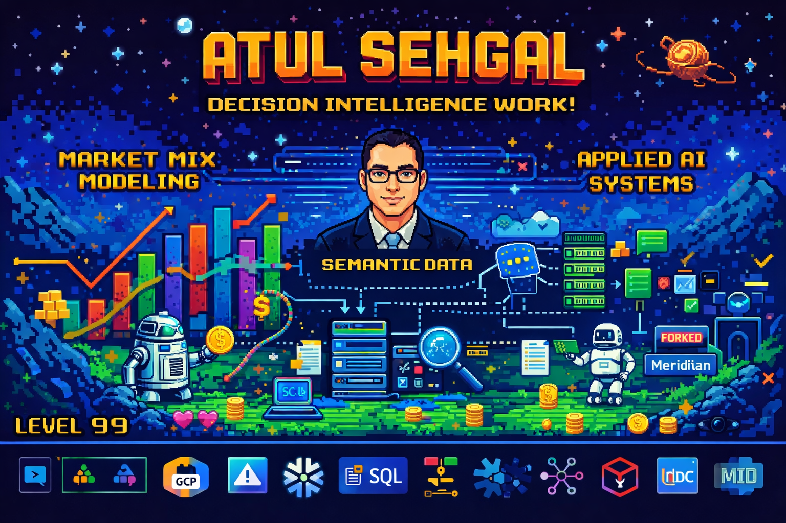

  

## 👋 Hi, I’m Atul

I design and deploy **decision intelligence and applied AI systems** that bridge
classical analytics, modern machine learning, and real business constraints.

My work focuses on building **production-grade AI** — systems that survive
financial scrutiny, organizational friction, and executive accountability.

---

### 🔍 What I work on
- 📊 **Market Mix Modeling** — Bayesian, causal, ROI-driven (Google Meridian)
- 🤖 **AI agents & LLM systems** for analytics and decisioning
- 🧠 **Semantic data layers** for governed self-service and natural language access
- 📈 **Forecasting, optimization, and simulation** at scale

---

### 🧩 Selected projects
- **Market Mix Model**  
  End-to-end Bayesian MMM pipelines with priors, calibration, and ROI insights

- **Talk to My Data**  
  LLM-powered semantic analytics over SQL with controlled schemas and reasoning

- **Self-Correcting Researcher**  
  Autonomous research agent with verification and self-reflection loops

---

### 🔒 Confidential / Client Projects
*(Details intentionally limited due to confidentiality)*

- **Trade Promotion Management (TPM) System**  
  Scenario planning and optimization platform for the beverage industry, deployed as a cloud-native web application (GCP / Azure) with a real-time simulation engine.

- **Industrial Cognitive Safety Platform**  
  Knowledge-graph and LLM-powered risk intelligence system leveraging ontologies to deliver predictive safety insights across industrial operations.

- **Leadership Collaborative Learning Platform**  
  Community knowledge-sharing platform enabling distributed expertise capture, synthesis, and retrieval at scale.

---

### 🧠 Philosophy
> I focus on AI systems that can be explained, governed, and trusted —
> not demos that collapse outside a notebook.

---

### 🔗 Tech stack
Python • SQL • Bayesian Modeling • Optimization • LLMs • LangChain •  
Snowflake • Databricks • GCP • Azure • Production ML Systems
